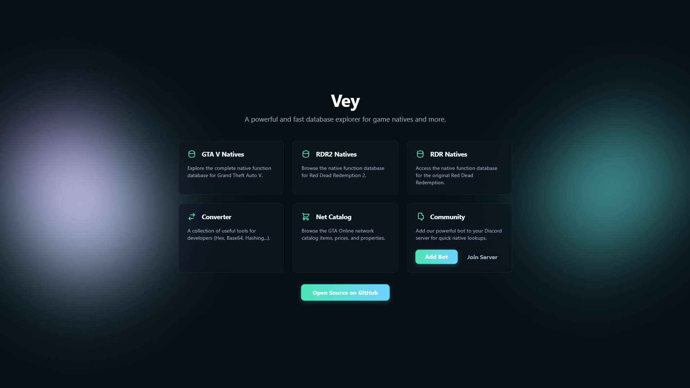
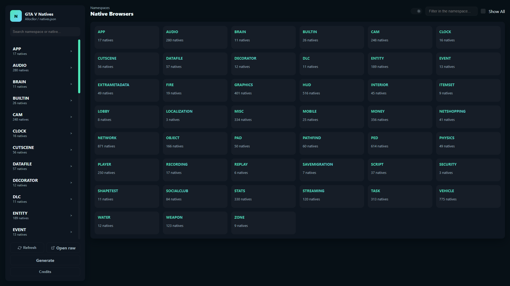
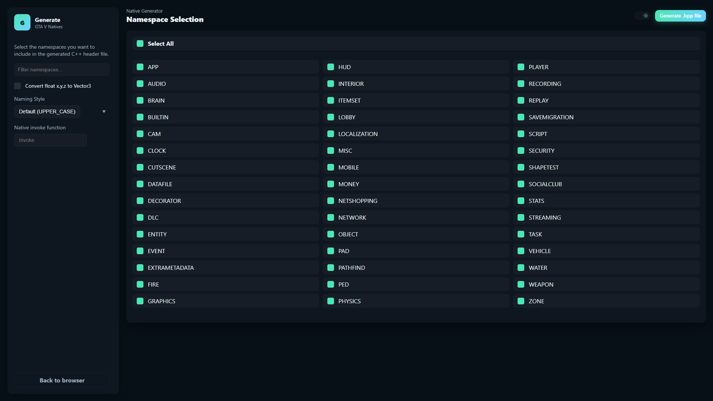

# Vey - NativeDB

A powerful and fast database explorer for game natives and development tools. Vey provides a comprehensive interface to explore, search, and generate C++ headers for native functions across multiple gaming platforms.

## Overview

Vey is a modern web-based application designed to simplify the exploration of native function databases for game developers. Whether you're working with GTA V, Red Dead Redemption 2, or the original Red Dead Redemption, Vey provides an intuitive interface to discover and utilize native functions.

## Features

### **Native Browsers**
- **GTA V Natives**: Explore the complete native function database for Grand Theft Auto V with organized namespaces
- **RDR2 Natives**: Browse the native function database for Red Dead Redemption 2
- **RDR Natives**: Access the native function database for the original Red Dead Redemption

Each namespace contains detailed information about functions including parameters, return types, and descriptions.

### **Native Generator**
Generate C++ header files from selected namespaces. Choose which namespaces to include and customize the output format for your specific development needs.

### **Converter Tools**
A collection of developer utilities including:
- **Number Converter**: Convert between different number formats
- **Text ↔ Base64**: Encode and decode text to/from Base64
- **URL Encoder/Decoder**: Encode and decode URLs
- **Hash Generator**: Generate various hash formats

### **Net Catalog**
Browse the GTA Online network catalog with comprehensive information about items, prices, and properties.

### **Discord Community**
- Add our powerful bot to your Discord server for quick native lookups
- Join the community server to connect with other developers

## Architecture

Vey is built as a single-page application with multiple specialized modules:
- Native Browser modules for efficient database exploration
- Conversion utilities for developer workflows
- Generation tools for C++ development
- Responsive dark-themed UI with aurora background effects

## Screenshots

### Home Page

### Native Browser

### Converter Tools

### Native Generator

## Community

- **GitHub**: https://github.com/Vey-vy/NativeDB
- **Discord**: https://discord.gg/cyNP2bn9xE
- Open source project welcoming contributions

